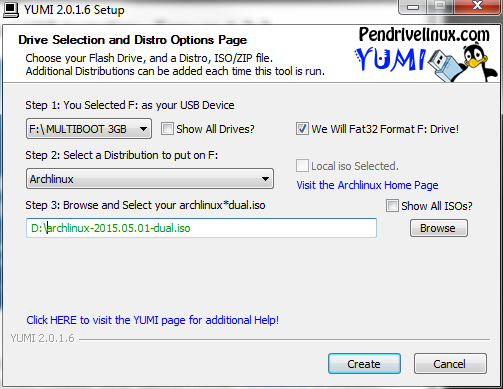
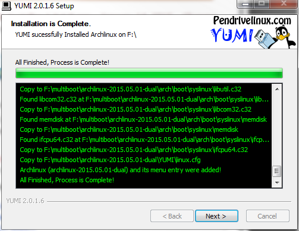
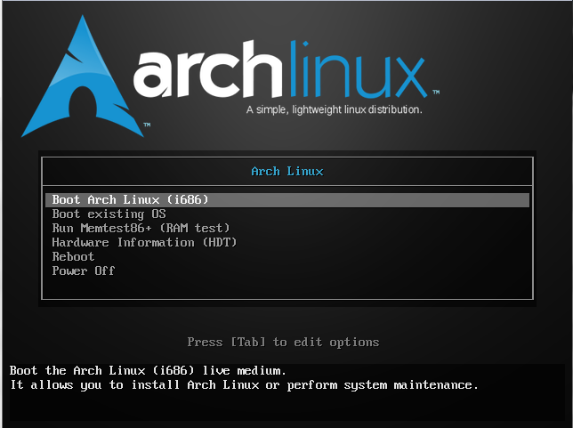
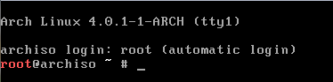
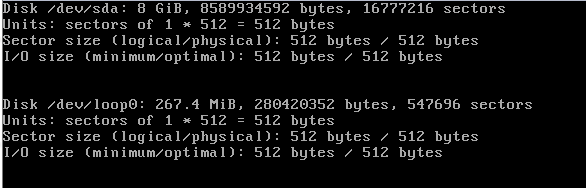

After years on Windows and having on a side this old Asus EeePC 11010HA taking dust on the storage I decided to give it a second life following the discovery of [Arch Linux](https://www.archlinux.org) and [Xmonad](http://xmonad.org/) from a friend whose working on a startup.  
I tried a lot of other windows and Linux distribution in the past on this machine without success mainly related to the video driver which is the Intel GMA500.  This post summarize how to setup Arch Linux on a laptop.
I will setup this machine as a Linux development machine until I fel confident that I can do a full switch of my main PC

Preparing the USB drive
===
The first setup before installing Arch Linux is to create a USB boot drive Installation. As I don't have any Linux machine for years I needed to find a way to create this USB boot drive on windows.

Download require
---
- [Yumi Multiboot](http://www.pendrivelinux.com/yumi-multiboot-usb-creator/) : This will allow you to create the USB Boot drive simply. If you have chocolatey install on your machine you can run the following command ```powershell
choco install yumi```
- [Arch Linux ISO](https://www.archlinux.org/download/): This is the ISO image

Creating the USB Boot drive
---
1. Open Yumi and set the parameters as below. Don't forget to check "*we Will Fat32 Format F: Drive!* "  
     

2. Click "*Create*" and wait for the creation of boot USB key
   

Installation of Arch Linux
===
The instruction below are mainly out from the youtube   [video](https://www.youtube.com/watch?v=Wqh9AQt3nho) that *Goguda55 Tech Tutorial* made. Thank you to him.
I added some information during the initial installation process, like installing wifi packages. These packages are useful when you are setting up a non wired computer

Instruction
--

You need to boot your computer using the USB key we made above.

1. ** Arch Linux Version Selection**  
   You can select the installation you want to do. In our case we want to install the i686 which is the 32 bits version of Arch Linux.  
   if you want to install a 64 bits version of ArchLinux you will have to select x86_64

     

   This will bring you to the basic command prompt. This prompt is the one of the installation OS which is hosted on the USB Key

     

2. **Find the install drive name**  
 Before we start installing ArchLinux we need to find the main drive that will be used to install it.
   Run the command  
   ```batch
   fdisk -l
   ```  
   This will list all the disk you have on your machine. In my case the command return.  You should see as result something like that  

   

   In my case the drive on which I want to install Arch Linux is */dev/sda*

3. **Create the partition on your hard drive**  
   We create two partition on the drive /dev/sda.

   **Remark**: Creating two partitions is the minimum you have to do. However you will find in the literature often that more partitions. However in our case two are enough.

    * Swap partition : half of the size of your memory
    * Data partition : We will create a single partition for all the rest. We won't try to be clever and create different partition for different folder.  

 Run the command below to start the partition manager :  
   ```batch
   cfdisk /dev/sda
   ```  
4. **Format the main partition and mount the new formatted disk**   
    We need to format the new data partition as ext4 (Current standard Linux file system type). Following this step we will have to mount the new formatted partition in the current Archlinux installation boot OS to be able to download and install the base Archlinux packages later on.  
    ```batch
    mkfs.ext4 /dev/sda2
    mount /dev/sda2 /mnt
   ```  
5. **Initialize  the Swap partition**  
  The Swap partition is initialize using the following simple command. The first one initialize the swap whereas the second enable it.  
   ```batch
    mkswap /dev/sda1
    swapon /dev/sda1
   ```
6. **Enable the network**  
  This can be different in function of the usage of wired or wireless network. I will explain below for wireless. Network using wire should be enabled by default. The base install image come with an utility that help you to find and set your wifi connection.  Run the command below to set your wifi connection.    
    ```batch
    wifi-menu
    ```  
7. **Download all the Archlinux base packages**  
  Now that we have the network we can download from the Internet all the base and base-devel packages ofArchlinux to the /mnt mount point. We do that by running the following command.  
    ```batch
    pacstrap /mnt base base-devel
    ```    
8. **Start ArchLinux partition**  
  Now that we downloaded all the packages required for the base image of ARchlinux it's time to start that new partition. Archlinux come with a specific toll that start the archlinux session as root. When you will run the command you will see the command prompt chamging.  
    ```batch
    arch-chroot /mnt
    ```   
9. **Change the root password**
  First think first. Securing the new installed OS. For that we need to chasnge the current password of the root account which we are connecting with. Run the follwoign command and enter the root password you want.  
    ```batch
    passwd
    ```    
10. **Enable the local setting**  
  The computer local settings a re define in the file  */etc/locale.gen*. This file contain all the locale predefine. We just have to uncomment the one we want to enable.  You can do that using 'vi' or 'nano'. In our case we wil use nano here. Wehn we finish editing the file /8/etc/locale.gen* we will run the command *lcoale-gen* to generate the file we need.  
    ```batch
    nano /etc/locale.gen
    locale-gen
    ```    
11. **set the time zone**  
  On Linux all the time zone info are define int eh location */usr/share/zoneinf*. We will have to create a link between the time zone we want and the file */etc/localtime*. The first command list the time zone info. Your time zone can be locate in another child folder. For example Paris is under the folder Europe. The second command create the link between the time zone we want and the configuration file that Linux is reading this information from.  
    ```batch
    ls /usr/share/zoneinfo -ali
    ln -s /usr/share/zoneinfo/Hongkong /etc/localtime
    ```  
12. **Give a name to the computer**  
  We have to set a file named */etc/hostna,e* that contain the name of hte current computer. The best way to do that is the print to the file the name using output redirection.  
  ```batch
  echo archlinuxEeePC > /etc/hostname
  ```  
13. **Install some useful packages for wireless**  
  As we are installing ArchLinux on a lap We top it's useful to install some  network tool to be able to reconnect after the reboot. The package is netctl that allow to manahge configuration using profile. We are installing as well dialog to allow the command *wifi-menu* that we used earlier to work.  
  ```batch
  pacman -S netctl dialog
  ```  
14. **Installing and Setting Grub boot loader**  
  Almost done.  :-)  
  We have now to install and set the bootloader. Teh most commun used today is Grub. The bootloader allow to choose the OS we want to boot and take all the driver initialize. The command we have to run are the following and will do :
      - Download the Grub package from internet.
      - Install Grub as bootloader on the drive */dev/sda*
      - Create the default configuration of Grub. This is the default one. We will on another article how to customize that.  
  ```batch
  pacman -S grub-bios
  grub-install /dev/sda
  mkinitcpio -p Linux
  grub-mkconfig -o /boot/grub/grub.cfg
  ```  
15. **Final steps. unmount and reboot**  
  Here we are... We have to run the below command to exit the current instance of ArchLinux we just set and return to the boot OS. Following that we will create the  static information about the file system and unmount the file system and finally reboot.  
  ```batch
  exit
  genfstab /mnt >> /mnt/etc/fstab
  umount /mnt
  shutdown -r
  ```  

Wrapping  
=======
Congration;ation to arrive at that point. WE now have a freshly install Archlinux base installation. In the next following article we will look at the following post installation step. Our final g
    - User and security
    - Network confuguration
    - basic service and toll setup
    - Windows Manager and windows windows
    - XMonad configuration
    - vi advance setup
    - Development environment setup for .Net/F#
