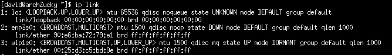

For this article we will focus on setting up inetwork setup (at least what I find so far) and look at some of the useful command that I use often now.

Setting up the network, and more specifically the wifi can be disturbing. However even without X windows they are some nice simple tool to help you to setup the wifi connection like 'wifi-menu' we used earlier.

If you follow the step to setup the base installation from this [article](Need to define) you should already have from your base installation the packages [netctl](https://wiki.archlinux.org/index.php/netctl) and [dialog](http://linuxcommand.org/lc3_adv_dialog.php). *netctl* is a batch script build on top of systemctl that allow to start or stop network profile configuraiton service.

Connection Manually
===================
Before trying to connect using some auto detection it's would be good to understand what is happening under the hood. *netctl* is  a simple command that allow you to list available profiles,  start profile or stop profile. In this section we will look first at how to setup a wired connection follow by a wifi one, and get a quick overview of the netctl command line tool.


Setting wire profile
====================

*netctl* is storing the connection profile in the folder */etc/netctl*. This folder has a child one named */etc/netctl/example* which contain a set of different example of profile. We are interested here about the example profile for which the name is starting with 'ethernet'. In my case I have 3 examples
    - ethernet-custom : Allow you to see all the available field you can setup
    - ethernet-dhcp : example to connect and getting the IP address from a DHCP server
    - etherbet-static : example to setup a profile using a static IP address

As my router is doing as well DHCP server for me, I will simple setup the profile using ethernet-dhcp as a sample. The step we have to do are:
    1. *Find the ethernet network interface name*
    Linux has a command line *ip* that allow you to query and update the network interfaces. The command line to run to list the network interface is  

    ```batch 
    ip link
    ```  
    The result of the query is in my case
      
    
    The ethernet adaptor name start everytime with *enp* and in my case the name is *enp3s0*  
    
    2. Copy the example */etc/netctl/example/ethernet-dhcp* to */etc/netctl* 
    We need to copy the example file */etc/netctl/example/ethernet-dhcp* to the folder */etc/netctl* and give it a name that is meaning full. In my case I will name it *enp3s0-ethernet-dhcp* because it's a good representation of the profile meaning.
    Back to the command shell to copy the file using :

    ```batch
    cp /etc/netctl/example/ethernet-dhcp /etc/netctl/enp3s0-ethernet-dhcp
    ```  
    
    3. Edit the Profile
    You can use any of the text editor you want, *vim* is the one I'm using every time. We want to open */etc/netctl/enp3s0-ethernet-dhcp* to change the property *Interface* with the one we found at the step 1.
    
    The content you should have in the file at the minimum is :
    
    

    4. Check the permission (We only want Root to have permission to the file)
    The profile we just update is good, however this is not protected to any unauthorise user to see. This profile doesn't have a lot of information that are important like it will be later on for the wifi setup. We will change the password usign the command line *chmod* and set read/write only for the root users.  

    ```batch
    chmod 600 enp3s0-ethernet-dhcp
    ```

    5. Plug the ethernet cable and start the profile
    We can now plug our ethernet cable and start the profile. We will use the command line netctl. The command to start the profile is   

    ```batch
    sudo netctl enp3s0-ethernet-dhcp
    ```

    The best command to test that the profile is enabled and that you can access the network is the ping the google dhcp server with the address 8.8.8.8 :-)
    


Connecting using wifi-menu
=========================

*wifi-menu* is an helper function that you can use to create your wifi settings for netctl, without knowing the wifi connection (WPA, WP2). *wifi-menu* is using a shell UI which is design with *dialog*. The result of the display can be seen below.


you can use the following command to get *wifi-menu* generate your wifi connection setting file that you will be able to see in */etc/netctl*.

```batch
    sudo wif-menu -o
```

You should see the following screen when you are running this command. 

![image wifi-menu][]


Using netctl manually
=====================

Before looking at how we can automate the connection using cable or wireless, it's good to have a quick overview of the basic option that the 


netctl package contain a non graphical 


find the name of the network interface
ip link


1. netctl to use with wifi-menu

2. Check the current service used for network. Only one network service can be started
   systemctl --type=service

3. You can use 'wifi-menu -o' to set your current connection

4. find your profile name ls /etc/netctl

5. start and enable your profile
netctl start profile
netctl enable profile


restart


sudo bash-completion
19. pacman -S

16. useradd -m -g users -G wheel,storage,power -s /bin/bash {username}
17. passwd {userName}
19. pacman -S iproute2
19. pacman -S wpa_supplicant
19. pacman -S wpa_supplicant_gui
19. pacman -S dialog
20. pacman -S wireless_tools
20. pacman -S netctl
20. pacman -S systemd-networkd

20. ip link
21. systemctl enable dhcpcd@NAME-OF-THE-NETWORK.service
